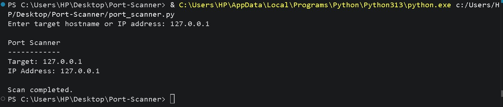
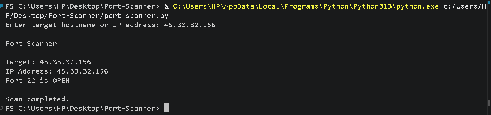

# Port Scanner

## Internship ID
**Internship ID:** CITS7218

## Project Overview
Port Scanner is a Python-based cybersecurity project that checks a target system for open TCP ports.

The project uses Python's socket library to attempt connections to ports and identifies ports that are accepting connections.

## Objectives
- To understand basic network port scanning.
- To understand TCP ports.
- To learn how socket connections work.
- To identify open ports on an authorized target.

## Features
- Target hostname or IP address input
- TCP port scanning
- Open port detection
- Basic error handling
- Scan completion status

## Technologies Used
- Python
- socket
- TCP/IP

## How It Works
1. The user enters a hostname or IP address.
2. The program resolves the target address.
3. The program checks ports from 1 to 100.
4. A TCP connection is attempted for each port.
5. If the connection succeeds, the port is displayed as OPEN.
6. After checking all ports, the scan is completed.

## How to Run

### 1. Install Python
Make sure Python 3 is installed on your system.

### 2. Run the Program

```bash
python port_scanner.py

### 3. Enter an Authorized Target

For local testing, use:

```text
127.0.0.1
## Sample Result

```text
Port Scanner
------------
Target: 127.0.0.1
IP Address: 127.0.0.1

Scan completed.
## Screenshots

### Port Scan Result

[](screenshots/port_scan.png)

### Open Port Detection

[](screenshots/open_port.png)

## Learning Outcomes

- Learned basic socket programming in Python.
- Understood TCP ports and connections.
- Learned how a basic port scanner works.
- Understood the importance of authorized security testing.

## Future Improvements

- Scan a custom port range.
- Add service identification.
- Add multithreading for faster scanning.
- Export scan results to a file.

## Disclaimer

This project is developed for educational purposes and should only be used on systems for which you have permission to perform security testing.